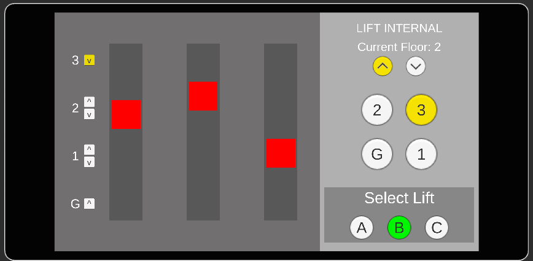

# 2D Elevator Simulation (Unity 6)

A robust, event-driven 2D elevator simulation built with Unity. The system handles multiple elevators and floor requests using an optimized routing algorithm.

**[🚀 Play the Live Demo on itch.io](https://devlovex.itch.io/elevatorsystem2d)**

## 🛠️ Technical Highlights

* **SCAN (Elevator) Algorithm:** Implemented industry-standard directional trip logic. Lifts prioritize all stops in their current direction before turning around.
* **Decoupled Architecture:** Utilizes C# Actions/Events for a "Smart Parent / Dumb Children" UI pattern. No expensive `Update()` polling.
* **Cost-Based Dispatcher:** The [ElevatorsManager](cci:2://file:///d:/Unity_Projects/ElevatorSystem/Assets/_ElevatorSystem/Scripts/Manager/ElevatorsManager.cs:10:4-103:5) calculates the most efficient lift for each call based on distance, current workload, and directional intent.
* **Data-Driven:** ScriptableObject-based configuration for easy tuning of lift speeds, floor heights, and door delays.
* **Smooth UX:** Powered by DOTween for logical floor-by-floor movement and real-time UI synchronization.

## 🕹️ Controls

* **External (Floor) Calls:** Click the Up/Down arrows on each floor to request a lift.
* **Internal Control:** Click **[A]**, **[B]**, or **[C]** to select a lift, then use the number pad to add internal stops.
